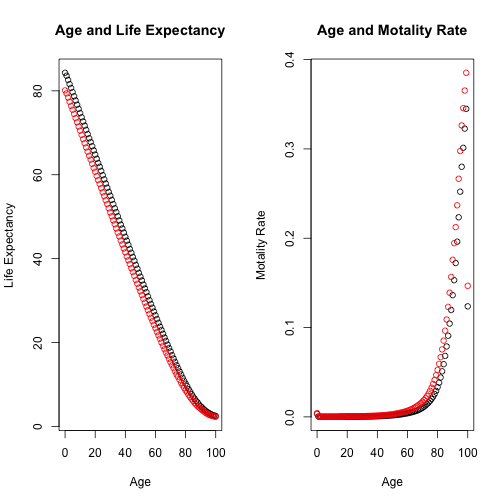

## Background

The ([**How long can I live**] (https://noahhhhhh.shinyapps.io/draft/)) app is served as an interactive tool which helps you to  
1. understand how many years left (**Life Expectancy**) for you at your age  
2. how likely you would die (**Moratility Rate**) within this year  

Also and *more importantly*, you can use several sliders (exercise, walk, cigarette consumption, and driving mileage) to see how the change in the life style can make a difference.


---

## A Bit Detail

1. **Dataset**  
1.1 The foundamental dataset comes from Australian Bureau of Statistics.  
1.2 It is in a format of life table, with a list of important parameters, such as death rate, life expectancy.  
2. **Fomula and calculation**  
1.1 Based on the life table, motality rate (mx(x)) is calcualtd with the below formula:  
$$ L(x) = l(x) + \frac {1} {2} l(x) q(x) $$
$$ m(x) = \frac {l(x) q(x)} {L(x)} $$
*p.s.*  
*l(x) is the total number of people survised at a certain year*  
*q(x) is the death rate at a certain year*  
*L(x) is the total number of people who are alive between a certain age and age + 1*  

---

## More Detail
1. More parameters are added as they strongly contribute to the life span  

1.1 Exercise:  
1 more hour on exercise per week will result in 4 days more in life expectancy each year  

1.2 30-min Brisk Walk:  
More than 6 times of 30-min Brisk walk per month will result in 44% decrease in death rate  

1.3 Cigarette Consumption:  
1 more cigarette per week will result in 3 days less in life expectancy each year  

1.4 Driving Mileage  
1000 miles more per year will result in .00365 day less in life expectancy each year  

---

## Theoretical Life Plot (Core of the app)


```r
par(mfrow=c(1,2))
plot(x = df_life$Age, y = df_life$ex, col = df_life$gender, main = "Age and Life Expectancy", xlab = "Age", ylab = "Life Expectancy")
plot(x = df_life$Age, y = df_life$mx, col = df_life$gender, main = "Age and Motality Rate", xlab = "Age", ylab = "Motality Rate")
```

 

